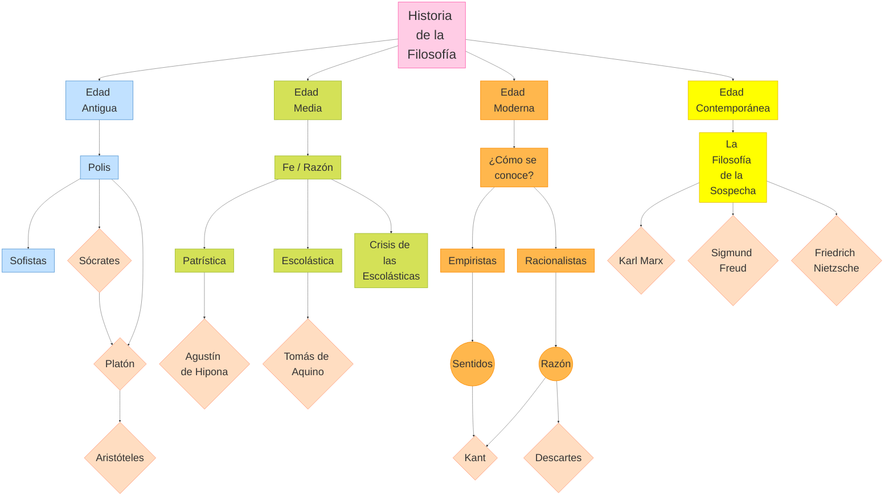

    
</head>
<body>

    

        <pre>

<h1>Ejemplo Real </h1>

Siendo su código el siguiente:

        </pre>
    

    

    <h1>Historia de la Filosofía</h1>
    
Tu pantalla es demasiado pequeña para soportar Gráficos Mermaid

    <ul>
        <li class="nivel-1">Edad Antigua
            <ul class="nivel-2">
                <li>Polis
                    <ul class="nivel-3">
                        <li>Sofistas vs Sócrates</li>
                        
                        <li>Sócrates
                            <ul>    
                                <li>Platón</li>
                                <li>Aristóteles</li>
                            </ul>
                        </li>
                    </ul>
                </li>
            </ul>
        </li>
        <li class="nivel-1">Edad Media
            <ul class="nivel-2">
                <li>Fe / Razón
                    <ul class="nivel-3">
                        <li>Patrística
                            <ul>
                                <li>Agustín de Hipona</li>
                            </ul>
                        </li>
                        <li>Escolástica
                            <ul>
                                <li>Tomás de Aquino</li>
                            </ul>
                        </li>
                        <li>Crisis de las Escolásticas</li>
                    </ul>
                </li>
            </ul>
        </li>
        <li class="nivel-1">Edad Moderna
            <ul class="nivel-2">
                <li>¿Cómo se conoce?
                    <ul class="nivel-3">
                        <li>Empiristas
                            <ul>
                                <li>(Sentidos)</li>
                            </ul>
                        </li>
                        <li>Racionalistas
                            <ul>
                                <li>(Razón)</li>
                                <li>Descartes</li>
                            </ul>
                        </li>
                        <li>Razón + Sentidos
                            <ul>
                            <li>Kant</li>
                            </ul>
                        </li>    
                    </ul>
                </li>
            </ul>
        </li>
        <li class="nivel-1">Edad Contemporánea
            <ul class="nivel-2">
                <li>La Filosofía de la Sospecha
                    <ul class="nivel-3">
                        <li>Karl Marx</li>
                        <li>Sigmund Freud</li>
                        <li>Friedrich Nietzsche</li>
                    </ul>
                </li>
            </ul>
        </li>
    </ul>

