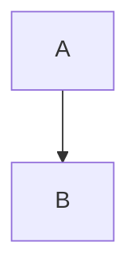
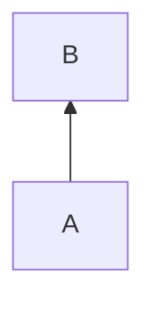
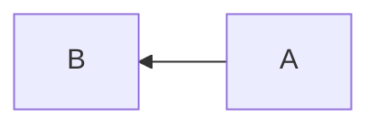
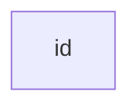
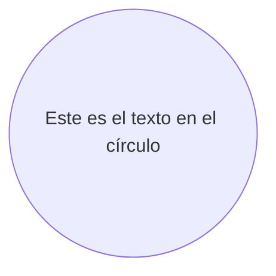
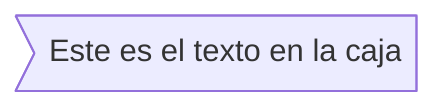
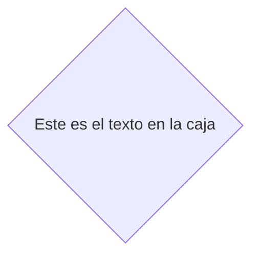
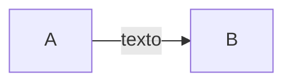
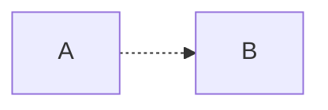
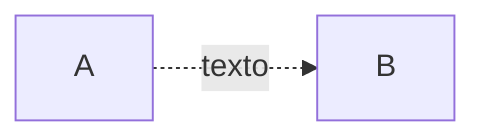

        
# 1. Diagramas de flujo

Un diagrama de flujo es un tipo de diagrama que representa un algoritmo, flujo de trabajo o proceso. El diagrama de flujo muestra los pasos como casillas de diversos tipos, y su orden conectando las casillas con flechas. Esta representación diagramática ilustra un modelo de solución a un problema dado.

## 1.1 Gráfico

Las direcciones posibles son:

* TB - arriba abajo
* BT - abajo arriba
* RL - derecha izquierda
* LR - izquierda derecha
* TD - igual que TB

<table>
  <thead>
    <tr>
      <th>Direction</th>
      <th>Diagram</th>
      <th>Definition</th>
    </tr>
  </thead>
  <tbody>
    <tr>
      <td>TB</td>
      <td>
        

        

      </td>
      <td><code>graph TB; A-->B;</code></td>
    </tr>
    <tr>
      <td>BT</td>
      <td>
        

        

      </td>
      <td><code>graph BT; A-->B;</code></td>
    </tr>
    <tr>
      <td>RL</td>
      <td>
        

        

      </td>
      <td><code>graph RL; A-->B;</code></td>
    </tr>
    <tr>
      <td>LR</td>
      <td>
        

        

      </td>
      <td><code>graph LR; A-->B;</code></td>
    </tr>
    <tr>
      <td>TD</td>
      <td>
        

        

      </td>
      <td><code>graph TD; A-->B;</code></td>
    </tr>
  </tbody>
</table>

## 1.2 Nodos y formas

<table>
  <thead>
    <tr>
      <th>Característica</th>
      <th>Diagrama</th>
      <th>Definición</th>
    </tr>
  </thead>
  <tbody>
    <tr>
      <td>Nodo (Predeterminado)</td>
      <td>
        

    

  </td>
  <td><code>graph LR; id;</code></td>
</tr>
<tr>
  <td>Nodo con Texto</td>
  <td>
    

    

  </td>
  <td><code>graph LR; id1[Este es el texto en la caja]</code></td>
</tr>
<tr>
  <td>Nodo con Bordes Redondeados</td>
  <td>
    

    

  </td>
  <td><code>graph LR; id1(Este es el texto en la caja)</code></td>
</tr>
<tr>
  <td>Nodo en Forma de Círculo</td>
  <td>
    

    

  </td>
  <td><code>graph LR; id1((Este es el texto en el círculo))</code></td>
</tr>
<tr>
  <td>Nodo en Forma Asimétrica</td>
  <td>
    

    

  </td>
  <td><code>graph LR; id1>Este es el texto en la caja]</code></td>
</tr>
<tr>
  <td>Nodo en Forma de Rombo</td>
  <td>
    

    

  </td>
  <td><code>graph LR; id1{Este es el texto en la caja}</code></td>
</tr>
</tbody> </table>

## 1.3 Enlaces entre nodos

<table>
  <thead>
    <tr>
      <th>Característica</th>
      <th>Diagrama</th>
      <th>Definición</th>
    </tr>
  </thead>
  <tbody>
    <tr>
      <td>Enlace con Punta de Flecha</td>
      <td>
        

    

  </td>
  <td><code>graph LR; A-->B</code></td>
</tr>
<tr>
  <td>Enlace con Punta de Flecha y Texto (1)</td>
  <td>
    

    

  </td>
  <td><code>graph LR; A-->|texto|B</code></td>
</tr>
<tr>
  <td>Enlace con Punta de Flecha y Texto (2)</td>
  <td>
    

    

  </td>
  <td><code>graph LR; A-- texto -->B</code></td>
</tr>
<tr>
  <td>Enlace Punteado</td>
  <td>
    

    

  </td>
  <td><code>graph LR; A-.->B;</code></td>
</tr>
<tr>
  <td>Enlace Punteado con Texto</td>
  <td>
    

    

  </td>
  <td><code>graph LR; A-. texto .-> B</code></td>
</tr>

</tbody> </table>

