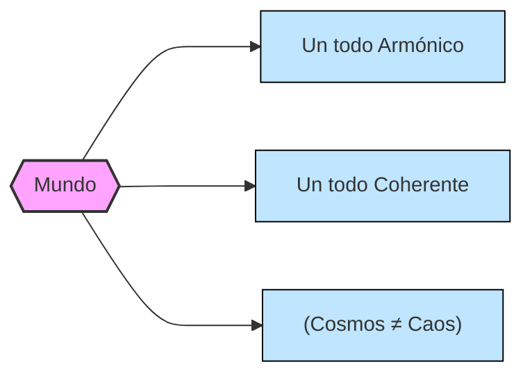
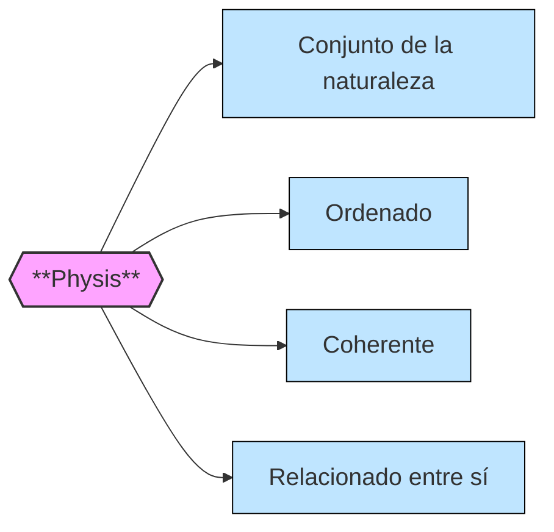
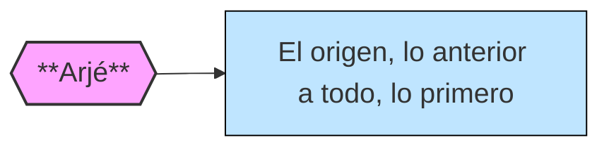
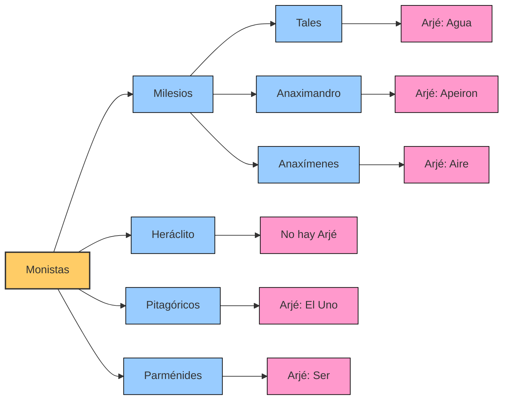
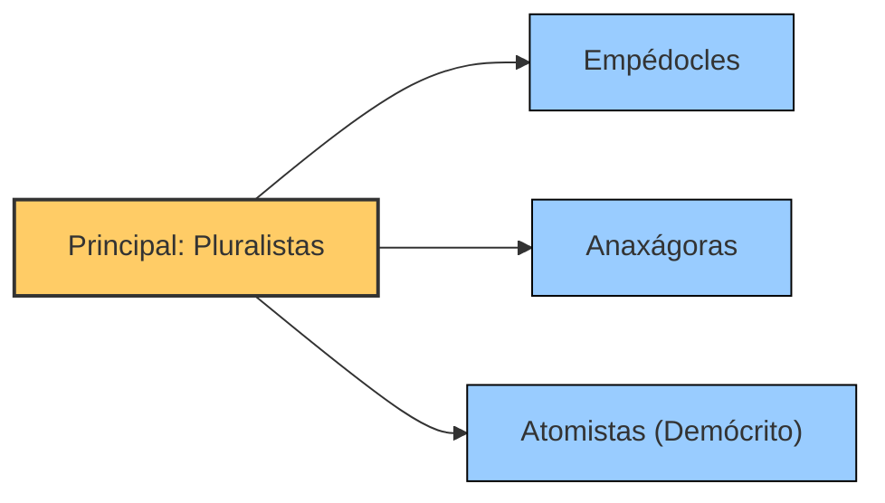
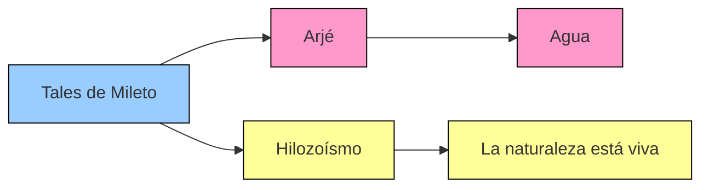
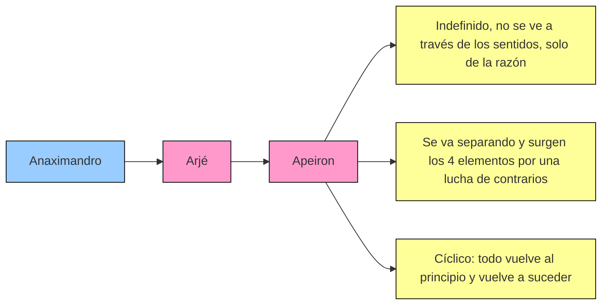
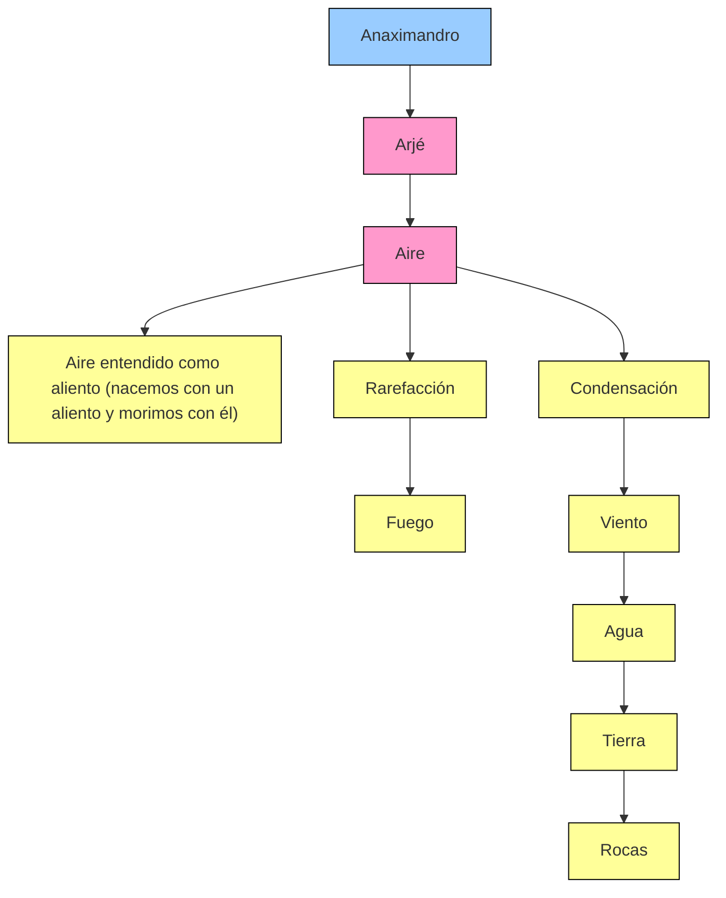

# FILÓSOFOS PRESOCRÁTICOS
 
## ¿Quiénes son y qué piensan?

* Filósofos antes de Sócrates y algunos temporáneos a él.
* De sitios y fechas diversas.
* Su cuestión principal era el origen (**arjé**) de la naturaleza (**physis**).

!!! info 

    Presuponen que en la naturaleza hay normas y leyes que lo rigen todo, (Normas = Nomos).

## Definición Arjé Y Physis

El hombre es capaz de conocer el Arjé por medio de la razón (razón = logos)

* **Alethèia** = Verdad oculta que vamos a descifraz por medio de la razón.

## Filósofos según su definición de Arjé

### Tales de Mileto

!!! info "Más información de Tales"

    [Ir a la página de Tales](https://pjp27.github.io/site/Filosof%C3%ADa/Tema%201.%20El%20Nacimiento%20de%20La%20Filosof%C3%ADa/Paso%20del%20mito%20al%20logo/#tales-de-mileto){ .md-button .md-button--primary }

### Anaximandro

### Anaxímedes

